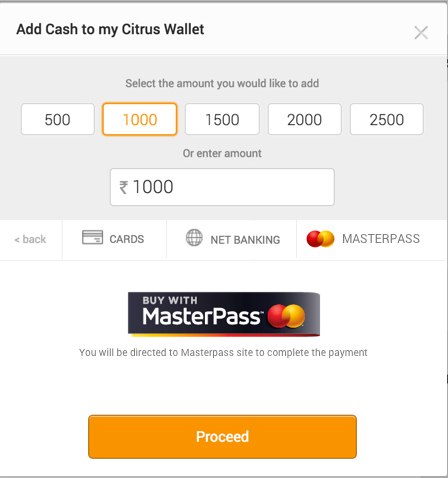

##Pay Using Masterpass
####You can design MasterPass Payment as below

####SDK provides below resources
1. masterpass.png
2. masterpass_selected.png
3. masterpass_unselected.png

####Below is the sample piece of code for MasterPass Payment
```groovy
  try {
        MasterPassOption masterPassOption = new MasterPassOption();
        PaymentType.PGPayment pgPayment = new PaymentType.PGPayment(new Amount(value), Constants.BILL_URL, masterPassOption, null);
        mCitrusClient.simpliPay(pgPayment, new Callback<TransactionResponse>() {
            @Override
            public void success(TransactionResponse transactionResponse) {
                Toast.makeText(getActivity(), transactionResponse.getMessage(), Toast.LENGTH_SHORT).show();
            }

            @Override
            public void error(CitrusError error) {
                Toast.makeText(getActivity(), error.getMessage(), Toast.LENGTH_SHORT).show();
            }
        });
     } catch (CitrusException e) {
        e.printStackTrace();
  }
```                

